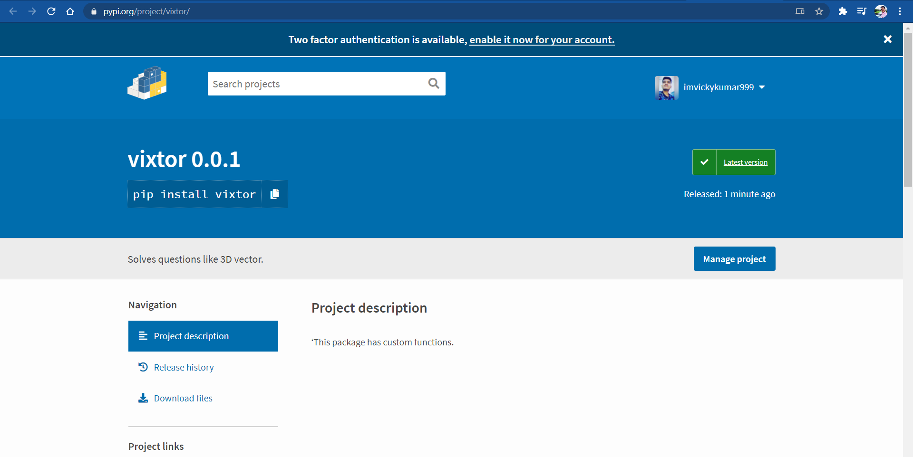
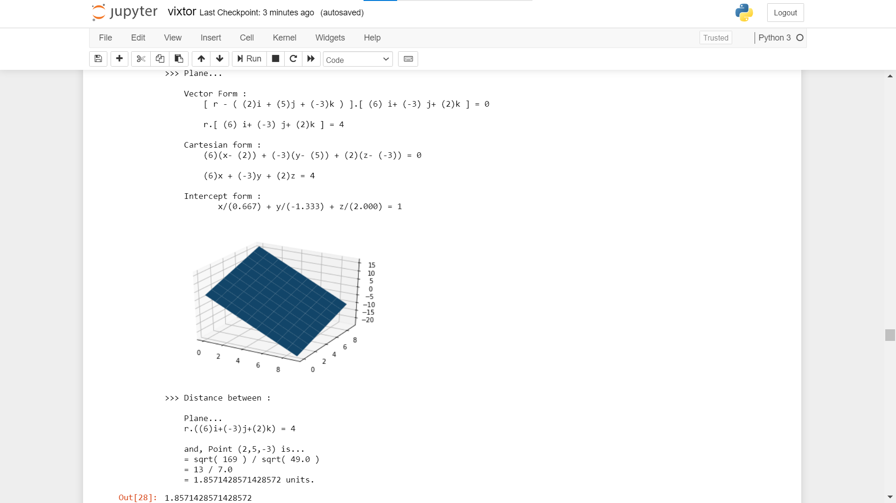

# vixtor

## How to install
`sh
$ pip install vixtor
`

#### ...made with love and hardwork ;)
#### [Post on LinkedIn](https://www.linkedin.com/feed/update/urn:li:activity:6715639149992394752/)

# Package : Vixtor = Vix (nickname) + Vector

This package can solve most of the questions of chapter 11, [NCERT](asstes/NCERT-Books-for-class%2012-Maths-Chapter%2011.pdf) (3D Vector) of class 12th.

check my my linkedin post out for demonstration on how to use package's function and fully explained by solving questions.

## How to Upload to PyPi :

> * creating a folder: any name
> * creating a sub folder : vector
> * creating a sub folder : vixtor
> * create init.py inside 2nd folder
> * create setup.py inside 1st folder
> * pip install setuptools
> * import setuptools
> * define setup configuration inside setup.py file
> * include manifest.in
> * include readme.txt
> * include license.txt
> * run 'python setup.py sdist' cmd in terminal
> * install twine package :'pip install twine'
> * twine upload dist/* or, python3 -m twine upload --repository-url https://test.pypi.org/legacy/ dist/*
> * Enter your PyPi username and then password.

[From](https://github.com/imvickykumar999) : Vicky Kumar